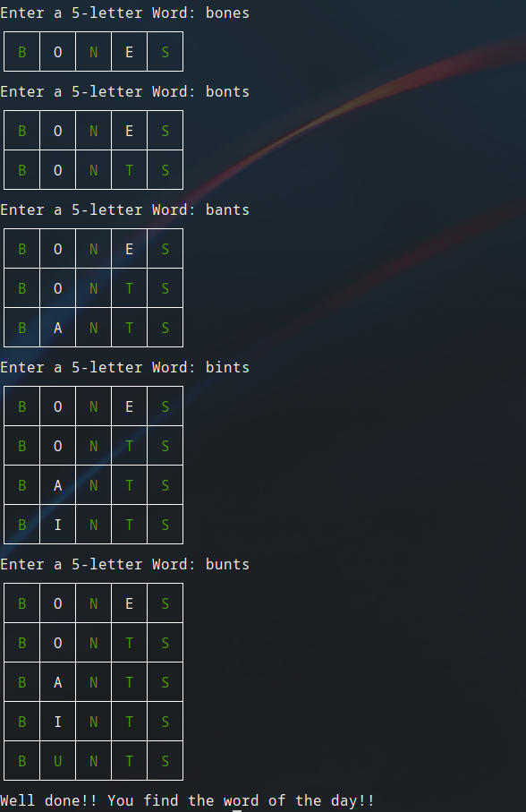

# Wordle Game
This is a mini-game of the popular Wordle game. It runs, for now, in the terminal.

# How to run
First, you need to clone this repository
```
git clone https://github.com/kaidewu/PythonExercises
```

After that, run this command

Windows:
```
python PythonExercises\Learning Python Exercises\Wordle\main.py
```

Linux:
```
python3 PythonExercises/Learning\ Python\ Exercises/Wordle/main.py
```

And now you can play! :)

# Snapshots

