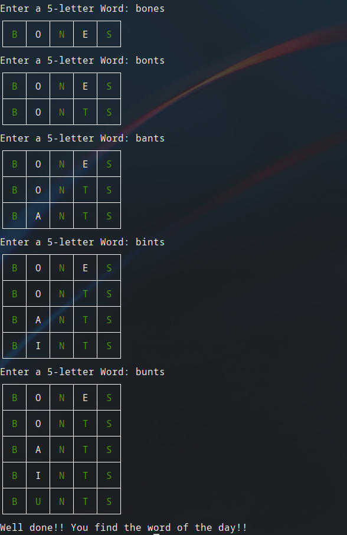

# Wordle Game
This is a mini-game of the popular Wordle game. It runs, for now, in the terminal.

# How to run
First, you need to clone this repository
```
git clone https://github.com/kaidewu/PythonExercises
```
Install  the requirements:
```
cd PythonExercises
```
```
python -m pip install -r requirements.txt
```

After that, run this command
Windows:
```
python Wordle\\main.py
```

Linux:
```
python3 Wordle/main.py
```

And now you can play! :)

# Snapshots

